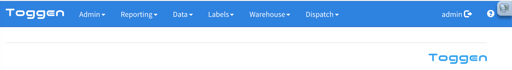

# Installation to a Docker Test Environment

1. Create a database in MYSQL, create and grant a user access
   ```sql
   CREATE DATABASE tgnwmsdb;
   GRANT ALL PRIVILEGES ON tgnwmsdb.* TO tgndbuser@localhost IDENTIFIED BY 'RandomCakeNameBoxPhoneNote';
   FLUSH PRIVILEGES;
   ```
2. Clone this repo
   ```sh
   git clone https://github.com/jmcd73/tgn-wms.git tgnwms
   # pull the docker and FileUpload repos
   cd tgnwms
   git submodule update --init --recursive
   ```
3. Install the database schema
   ```sh
   cd dev/sampledbs
   mysql -utgndbuser -p tgnwmsdb < skeleton-db.sql
   ```
4. Build docker image
   ```sh
   cd ../../docker/
   docker build -t tgn/php73:v2 .
   ```
5. Run the container

   ```sh
   #!/bin/sh
   CUPS_PORT=634
   APACHE_PORT=8634
   DOCKER_TAG=tgn/php73:v2 # tag (-t) you used for docker build
   VOLUME=~/sites/tgnwms/
   CONTAINER_NAME=tgnwms

   docker run  --name $CONTAINER_NAME \
   -v ${VOLUME}:/var/www  -d \
   -p ${CUPS_PORT}:631 -p ${APACHE_PORT}:80 $DOCKER_TAG
   ```

6. Test connection to CUPS and Apache

   > [http://localhost:634/](http://localhost:634/)
   >
   > [http://localhost:8634](http://localhost:8634)

   You should get the CUPS admin page for the first URL and a HTTP 500 ERROR for the second

7. Login to the docker container
   ```sh
   docker exec -ti tgnwms /bin/bash
   # you should see a root prompt
   root@495bdffd3c45:/var/www#
   # check apache logs for the 500 error
   cd /var/log/apache2/
   vim error.log
   # you should see a complaint about not being able to find cake core
   ```
8. Install the vendor files

   Still in the docker container...

   ```sh
   cd /var/www

   # install the PHP dependencies
   composer install
   ```

9. Create and edit database config

   ```sh
   cd app/Config
   cp database.php.default database.php
   ```

   Edit the file to have the correct host, user, db, password parameters

   ```php
   // app/Config/database.php

   class DATABASE_CONFIG {

       public $default = [
               'datasource' => 'Database/Mysql',
               'persistent' => false,
               /* if your mysql server is running on the
                * docker host this is the hostname
                * Otherwise change this to the host that
                * is running MySQL
                */
               'host' => 'host.docker.internal',
               'login' => 'tgndbuser',
               'password' => 'RandomCakeNameBoxPhoneNote',
               'database' => 'tgnwmsdb',
               'prefix' => '',
               //'encoding' => 'utf8',
       ];

   }
   ```

   Open app/Config/configuration.php and edit datasources to include a reference to the default database.php config

   The app/Config/configuration.php file contains app wide settings and allows you to configure multiple database environments and swap them using a `SetEnv ENVIRONMENT <ENV_NAME>` directive in the Apache .htaccess file

   ```php
   // app/Config/configuration.php
   //... snippage
   'datasources' => [
       'HOME' => 'default', // my laptop
       'TEST' => 'test', // test
       'NEWTEST' => 'palletsTest'
   ],
   //... snippage
   ```

10. Install htaccess files

    ```sh
    cd /var/www
    mv htaccess.txt .htaccess
    # edit this top level .htaccess and SetEnv CAKEPHP_DEBUG 2 to enable DebugKit or 0 to disable
    # When in DEBUG mode the navbars will be black when in normal production mode the navbars will be blue

    cd app/
    mv htaccess.txt .htaccess
    cd webroot
    mv htaccess.txt .htaccess
    ```

11. Edit the ENVIRONMENT value to match the configuration.php value

    ```sh
    vim /var/www/.htaccess
    ```

    ```apacheconf
    SetEnv CAKEPHP_DEBUG 2
    Header Set X-Forwarded-Host "frontend.toggen.com.au"
    SetEnv ENVIRONMENT HOME

    <IfModule mod_rewrite.c>
    RewriteEngine On
    RewriteRule ^(docs)($|/) - [L]
    RewriteRule    ^$    app/webroot/    [L]
    RewriteRule    (.*) app/webroot/$1    [L]
    </IfModule>
    ```

12. At this point if the above instructions are correct you should be able to connect to [http://localhost:8634](http://localhost:8634) and get the main screen

    Most menu items are public but if authentication and authorization is required you will be redirected to a login screen. The default username and password for the CakePHP application is `admin/admin`

    The default **root** password for the docker container is defined in the Dockerfile as `HeartMindSoul`. You will need this if when you add printers via CUPS.

    The `tgn-wms-db.sql` file imported above pre-populates the database with some product types & items, sample labels, a PDF Printer and some sample data

    By default DebugKit is enabled and can be disabled by removing or commenting out the `SetEnv CAKEPHP_DEBUG 2` statement in the /var/www/.htaccess file

    

## Next Steps

After completing the above installation steps see [SETUP.md](SETUP.md) for a step by step for configuring your own customized environment
