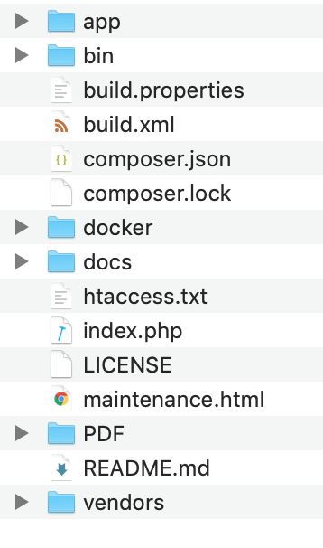
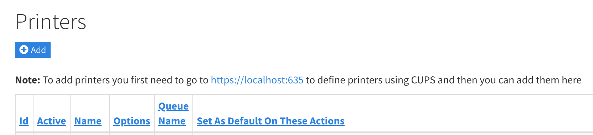
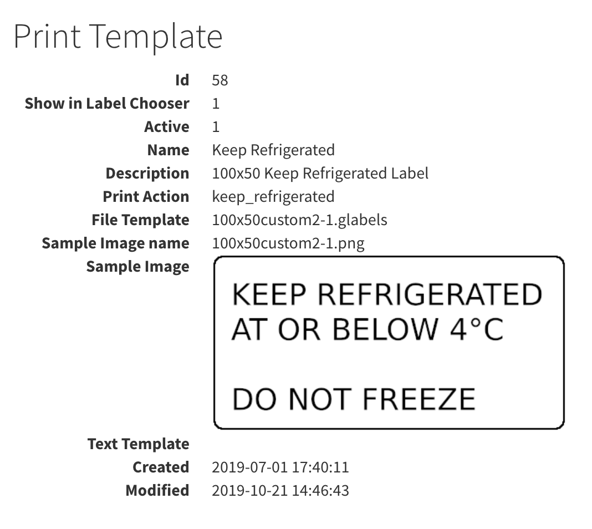

# Printing
## Development environment print setup
There is a default CUPS-PDF printer defined and it will output to a PDF folder located on the same level as the app and vendor folders

## Adding printers
To add printers is a two step process
1. Define a print queue in CUPS
    1. For the docker environment to find the URL of the CUPS admin page goto Admin => Printers and view the **Note:**

    

    1. Download and install printer drivers if needed
    1. Queue name
    1. socket or network url. Usually it will be something like `socket://10.77.81.22:9100`
    1. Printer Make / Model
    1. Configure defaults
1. Define a printer in Toggen WMS
    1. After adding the printer in CUPS
    1. Login as an admin and goto Admin => Printers
    1. **Name** &mdash; Friendly name of printer i.e. "PDF Printer"
    1. **Options** &mdash; Specify `-o raw` for text templates or blank if you want to use the graphical filters for printing gLabels or similar
    1. **Queue Name** &mdash; Select the previously defined CUPS queue
    1. **Set As Default On These Actions** &mdash; Use checkboxes to define Controller / Actions that should use this printer as the default

    ![Edit printer][edit_printer]

## Print Templates

### About Print Templates

There are 2 types of print templates

1. Text templates - These are raw text that contain tokens that are replaced with variable data when printed. They are sent straight to the printer as text using the `-o raw` option

1. File templates - These are `{template_name}.glabels` files and use `glabels-3-batch` to output PDF's which are then sent to the printer

### Adding Print Templates

Add new print templates under `Admin => Print Templates`

**Note:** For each Print Template record specify either a `Text Template` or `File Template` do not populate both fields.

For ***Text Template*** copy and paste the template data into the field
For ***File Template*** design a template using GLabels under Linux and upload it

### To View Included Label Samples
A number of sample print templates are provided by default

See [../app/webroot/files/templates](../app/webroot/files/templates) for label sample images

## Application Print Controller Action List

These are the Controller Action combinations that have print screens attached to them

| Controller | Action | Description |
|------------|--------|-------------|
| LabelsController | pallet_print | CAB Printer Language Pallet Label Print |
| LabelsController | reprint | CAB Reprint Pallet Labels |
| PrintLabelsController | carton_print | CAB 100x50 Carton Labels |
| PrintLabelsController | crossdock_labels | gLabels 150x200 Labels |
| PrintLabelsController | shipping_labels | gLabels 150x200 Labels |
| PrintLabelsController | shipping_labels_generic | gLabels 150x200 |
| PrintLabelsController | keep_refrigerated | gLabels 100x50 Fixed Text Keep Refrigerated |
| PrintLabelsController | glabel_sample_labels | gLabels 100x50 Product Sample Labels |
| PrintLabelsController | big_number | Zebra Printer Language 100x200 Labels |
| PrintLabelsController | custom_print | gLabels 100x50 assorted label prints |
| PrintLabelsController | sample_labels | gLabels 100x50 company logo with product details |

[edit_printer]: images/edit_printer.png