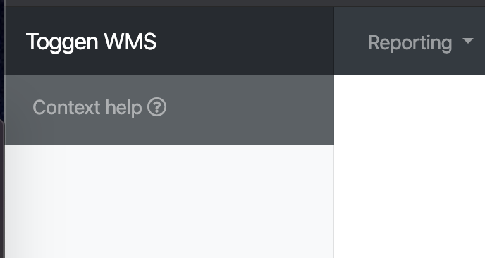

## How to add to the help system

Create markdown documents in `/docs/help`

Place images in `/docs/help/images`

Go to Admin => Help and add a record for each Controller / Action you want a context sensitive help page

The help icon will appear under the navbar brand on the top left of the screen

