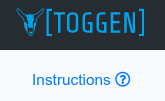

# Application Online Help

## How it works
The online help is written in markdown documents and placed in `webroot/docs/help` images are placed in `webroot/docs/help/images`

From within the application help is associated with different screens by going to Admin => Help and then adding a record that relates a Controller/Action with the markdown document

Once the mapping is established a help icon will appear in the sidebar on any page with linked help:

Here are some examples of the Controller::Action to Markdown mappings

| Controller / Action | Markdown Document |
|---------------------|-------------------|
| PalletsController::palletPrint | PALLET_PRINT.md |
| ShipmentsController::addApp | ADD_APP.md |
| ShipmentsController::index | DISPATCH_INDEX.md |
| SettingsController::index | SETTINGS.md  |

The URLs in the application map to the controller / action

    http://localhost:8083/Pallets/onhand = PalletsController::onhand
