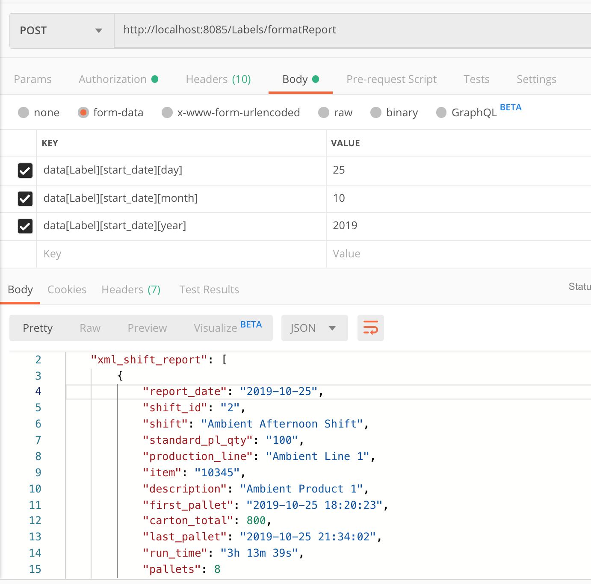

# Reporting

With the proviso that you have setup production lines and pack sizes you can run reports using something like Pentaho Community Edition and output to PDF and forward via email

## Daily Shift Report endpoint

The Shift report accessible under Reporting => Shift Report also outputs XML or JSON by changing the Accept header of the request to application/xml or application/json respectively

You need to POST to the endpoint:

```
data[Label][start_date][day]:25
data[Label][start_date][month]:10
data[Label][start_date][year]:2019
```

**Docker environment report endpoint:** `http://localhost:8085/Pallets/shiftReport`

## Postman


## Sample Output

```json
{
    "xml_shift_report": [
        {
            "report_date": "2019-10-25",
            "shift_id": "2",
            "shift": "Ambient Afternoon Shift",
            "standard_pl_qty": "100",
            "production_line": "Ambient Line 1",
            "item": "10345",
            "description": "Ambient Product 1",
            "first_pallet": "2019-10-25 18:20:23",
            "carton_total": 800,
            "last_pallet": "2019-10-25 21:34:02",
            "run_time": "3h 13m 39s",
            "pallets": 8
        },
        {
            "report_date": "2019-10-25",
            "shift_id": "2",
            "shift": "Ambient Afternoon Shift",
            "standard_pl_qty": "100",
            "production_line": "Ambient Line 2",
            "item": "10345",
            "description": "Ambient Product 1",
            "first_pallet": "2019-10-25 18:21:06",
            "carton_total": 600,
            "last_pallet": "2019-10-25 21:33:45",
            "run_time": "3h 12m 39s",
            "pallets": 6
        },
        {
            "report_date": "2019-10-25",
            "shift_id": "3",
            "shift": "Ambient Night Shift",
            "standard_pl_qty": "100",
            "production_line": "Ambient Line 1",
            "item": "10345",
            "description": "Ambient Product 1",
            "first_pallet": "2019-10-25 23:19:14",
            "carton_total": 200,
            "last_pallet": "2019-10-25 23:23:44",
            "run_time": "0h 4m 30s",
            "pallets": 2
        },
        {
            "report_date": "2019-10-25",
            "shift_id": "3",
            "shift": "Ambient Night Shift",
            "standard_pl_qty": "100",
            "production_line": "Ambient Line 2",
            "item": "10345",
            "description": "Ambient Product 1",
            "first_pallet": "2019-10-25 23:01:08",
            "carton_total": 500,
            "last_pallet": "2019-10-25 23:23:41",
            "run_time": "0h 22m 33s",
            "pallets": 5
        },
        {
            "report_date": "2019-10-25",
            "shift_id": "5",
            "shift": "Chilled Night Shift",
            "standard_pl_qty": "48",
            "production_line": "Chilled Line 1",
            "item": "20123",
            "description": "Desc Chilled 1",
            "first_pallet": "2019-10-25 20:47:54",
            "carton_total": 1056,
            "last_pallet": "2019-10-25 23:24:41",
            "run_time": "2h 36m 47s",
            "pallets": 22
        }
    ]
}

```

```xml
<?xml version="1.0" encoding="UTF-8"?>
<response>
  <xml_shift_report>
    <report_date>2019-10-25</report_date>
    <shift_id>2</shift_id>
    <shift>Ambient Afternoon Shift</shift>
    <standard_pl_qty>100</standard_pl_qty>
    <production_line>Ambient Line 1</production_line>
    <item>10345</item>
    <description>Ambient Product 1</description>
    <first_pallet>2019-10-25 18:20:23</first_pallet>
    <carton_total>800</carton_total>
    <last_pallet>2019-10-25 21:34:02</last_pallet>
    <run_time>3h 13m 39s</run_time>
    <pallets>8</pallets>
  </xml_shift_report>
  <xml_shift_report>
    <report_date>2019-10-25</report_date>
    <shift_id>2</shift_id>
    <shift>Ambient Afternoon Shift</shift>
    <standard_pl_qty>100</standard_pl_qty>
    <production_line>Ambient Line 2</production_line>
    <item>10345</item>
    <description>Ambient Product 1</description>
    <first_pallet>2019-10-25 18:21:06</first_pallet>
    <carton_total>600</carton_total>
    <last_pallet>2019-10-25 21:33:45</last_pallet>
    <run_time>3h 12m 39s</run_time>
    <pallets>6</pallets>
  </xml_shift_report>
  <xml_shift_report>
    <report_date>2019-10-25</report_date>
    <shift_id>3</shift_id>
    <shift>Ambient Night Shift</shift>
    <standard_pl_qty>100</standard_pl_qty>
    <production_line>Ambient Line 1</production_line>
    <item>10345</item>
    <description>Ambient Product 1</description>
    <first_pallet>2019-10-25 23:19:14</first_pallet>
    <carton_total>200</carton_total>
    <last_pallet>2019-10-25 23:23:44</last_pallet>
    <run_time>0h 4m 30s</run_time>
    <pallets>2</pallets>
  </xml_shift_report>
  <xml_shift_report>
    <report_date>2019-10-25</report_date>
    <shift_id>3</shift_id>
    <shift>Ambient Night Shift</shift>
    <standard_pl_qty>100</standard_pl_qty>
    <production_line>Ambient Line 2</production_line>
    <item>10345</item>
    <description>Ambient Product 1</description>
    <first_pallet>2019-10-25 23:01:08</first_pallet>
    <carton_total>500</carton_total>
    <last_pallet>2019-10-25 23:23:41</last_pallet>
    <run_time>0h 22m 33s</run_time>
    <pallets>5</pallets>
  </xml_shift_report>
  <xml_shift_report>
    <report_date>2019-10-25</report_date>
    <shift_id>5</shift_id>
    <shift>Chilled Night Shift</shift>
    <standard_pl_qty>48</standard_pl_qty>
    <production_line>Chilled Line 1</production_line>
    <item>20123</item>
    <description>Desc Chilled 1</description>
    <first_pallet>2019-10-25 20:47:54</first_pallet>
    <carton_total>1056</carton_total>
    <last_pallet>2019-10-25 23:24:41</last_pallet>
    <run_time>2h 36m 47s</run_time>
    <pallets>22</pallets>
  </xml_shift_report>
</response>
```
