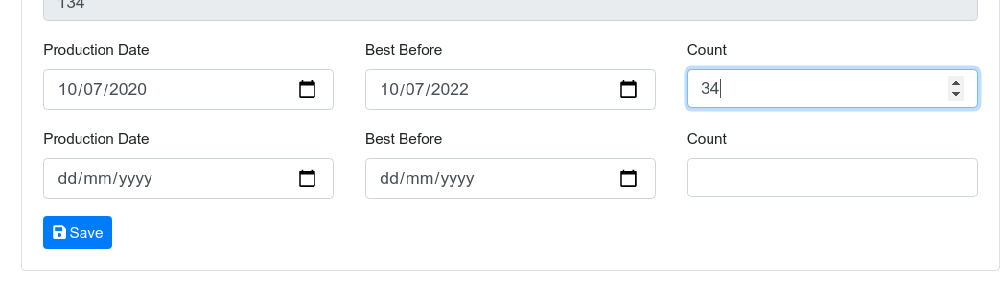
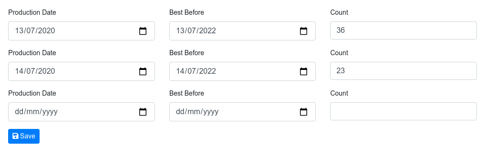
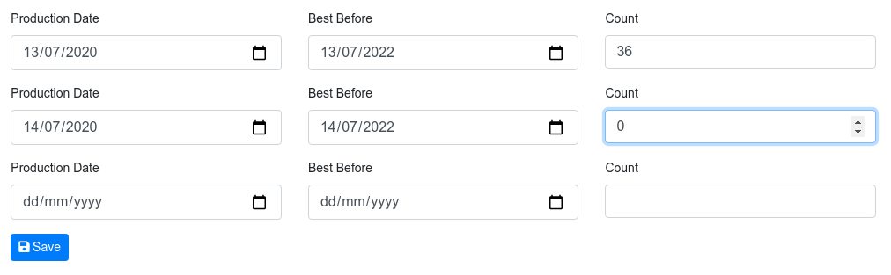
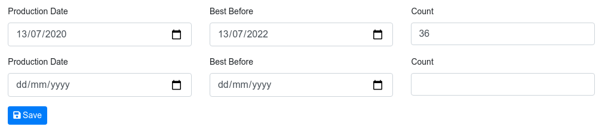
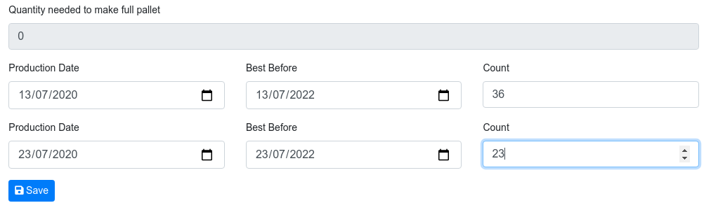
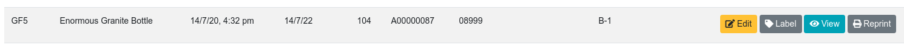

# Modify Pallet Records

This screen allows updating:

* Batch Number
* Production and Best before dates
* Add and removing Cartons and adjust pallet carton quantities
* Setting inventory status and a status note
* Marking a pallet to allow shipment if it is low dated stock

## Modify pallet quantity
Change the count value on the carton Production date, Best Before, Count row

## To Delete a Carton Record

Find the cartons you want to delete from the pallet

Set the count to 0 and click save

The record will be removed

## To Add Cartons with a different best before date to a part pallet
In the "Change cartons or dates" section of the screen

Find the Production Date, Best Before & Count row at the bottom of the area that doesn't have any values entered as yet.

Enter a unique Production Date.

Best before will auto-fill with the Production Date plus the item Days Life value. e.g. 11/07/2020 + 730 days = 11/07/2022 

Enter the carton count to add

The `Quantity needed to make full pallet` field will show how many more carton needed to make a full pallet. When `Quantity needed to make full pallet` is zero the pallet is full

Click Save

Once the record is saved you will return to the screen you were on before

## Pallet Label might have changed
Once you have edited a pallet / carton records

You may need to re-print and re-apply the pallet label. 

The updated label can be accessed from the following screens

* Labels => Re-Print
* Warehouse => Pallet Track
* Warehouse => On-Hand

